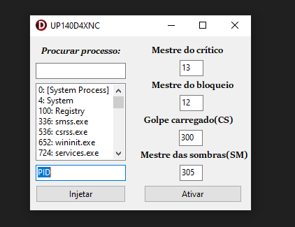

# Trainer para Alteração de Poder de Ataque das Habilidades (Priston Tale - Servidor Privado)

Este projeto é um exemplo de trainer desenvolvido em Delphi, criado para manipular a porcentagem do poder de ataque das skills em um servidor privado do jogo **Priston Tale**. A interface do trainer permite listar processos em execução, anexar e modificar valores em endereços de memória para ajustar a performance das habilidades no jogo.

> **Atenção**: Este trainer foi desenvolvido **apenas para fins educacionais**. O uso deste código para manipulação de memória de processos em servidores de jogos pode violar os termos de serviço do servidor e resultar em penalidades. Use com responsabilidade.

## Funcionalidades

- Lista processos em execução no sistema.
- Permite anexar a um processo pelo seu PID.
- Modifica a porcentagem do poder de ataque das skills.
- Interface gráfica desenvolvida com VCL.

## Tecnologias Utilizadas

- Delphi
- API do Windows (Toolhelp32Snapshot, OpenProcess, WriteProcessMemory)

## Como Usar

1. Clone este repositório.
2. Abra o projeto no Delphi.
3. Compile e execute.
4. Selecione o processo do servidor privado de **Priston Tale** e insira os valores de ataque desejados nos campos correspondentes.
5. Clique em "Anexar" e depois "Aplicar" para alterar a porcentagem de ataque das skills no jogo.

## Importante

Este projeto foi desenvolvido com o objetivo de aprender manipulação de memória com Delphi. **Não deve ser utilizado para prejudicar a integridade de servidores de jogos ou trapacear em jogos online**. O uso indevido pode violar os termos de uso de softwares e resultar em sanções.

